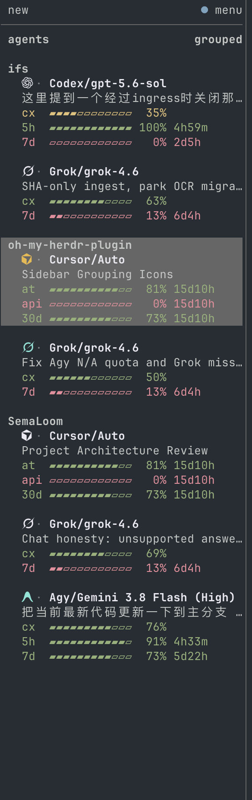

# herdr-agent-quota

在 Herdr Agent 侧栏显示模型、上下文和订阅额度——按 Space 分组，并用品牌图标承载
agent 状态。

[](https://github.com/levi-qiao/herdr-agent-quota/actions/workflows/ci.yml)
[](LICENSE)

[English](README.md)



Agent 按所属 Space 分组：加粗的 Space 名紧贴第一个 agent，下一个 Space 前空一行（默认 `row_gap = 1` 时为两行；在 `[ui.sidebar.agents]` 设 `row_gap = 0` 即为一行）。每一行只用本插件的品牌图标，不再画 Herdr 原生状态圈；
图标颜色跟随 agent——工作中为黄、完成后为青绿；聚焦该 pane，或焦点从它移走后变为墨白。其他未读的绿色 pane 不受影响。
Provider／模型保持墨白色；进度条上的严重程度色仍表示剩余额度。

默认布局是 `gauges`：在每个额度数字旁加一条进度条。进度条长度始终对应旁边打印的数字；
`cx`、`5h`、`7d`、`30d` 都跟随 `quota-percent`。标签列三个字符，内置周期对齐；
服务商自定义的窗口名过长时退回普通数字行，而不是截断进度条。进度条按当前连接的
Herdr endpoint 侧栏宽度定长（已计入缩进和滚动条）。空字段自动折叠，百分比可选择
显示剩余或已用额度。Cache 与 TTL 默认关闭（需要时可在设置里打开）。Agent order
默认按 Space 分组，组内剩余额度最少的优先。低额度通知默认关闭，直到你设置阈值。
布局、字段和百分比口径都可以在设置面板里改（`prefix+shift+q`）。

## 安装与升级

要求：**Herdr 0.9.0+**、`rust-toolchain.toml` 指定的 Rust 工具链、macOS 或 Linux，
以及受支持的 agent CLI。

```sh
git clone https://github.com/levi-qiao/herdr-agent-quota.git
cd herdr-agent-quota
./install.sh
```

只启用部分 agent：`./install.sh --agent claude,codex,omp`。
仅在需要加载新安装的 hook 或 Herdr integration 时，才需重启已经运行的 agent 会话。

在仓库目录升级：

```sh
git pull --ff-only
./install.sh
```

升级保留已有偏好，修复插件管理的配置，重新读取额度并自动恢复后台更新。
不需要删除缓存或管理 watcher 进程；Herdr 服务端连接变化后，watcher 会自动接管。

## 设置

按 `prefix+shift+q` 打开；若该快捷键已有其他用途，可运行：

```sh
herdr plugin pane open --plugin herdr-agent-quota --entrypoint settings --focus
```


| 设置 | 可选项 |
| --- | --- |
| Percentages | 剩余或已用比例；颜色始终表示剩余额度 |
| Layout | `gauges`（默认）在每个额度数字旁加进度条；`packed` 合并相关字段；`stacked` 将字段分行显示 |
| Row gap | Agent 之间保留零行或一行空白 |
| Watch interval | 30 秒–1 小时，默认 60 秒 |
| Fields | 默认开启提供方、主题、模型、上下文、短期／长期／月度额度；cache 与 TTL 可选 |
| Agent order | 按 Space 分组，组内剩余额度最少优先（默认）；或使用 Herdr 自己的排序 |
| Low quota alert | 关闭，或设置 1%–100% 的提醒阈值 |
| Icon size | 侧栏图标小、中（默认）、大。仅 WezTerm：尺寸名写入 WezTerm 配置目录的 `herdr-icon-size.local.json`，应用后按 Ctrl+Shift+R。其他终端保持原有图标大小；正文字号不变 |
| Account summary | `off`（默认）在每个 agent 行显示额度条。`compact`（3 格条 + 重置时间）、`bars`（4 格条）或 `numbers` 改为在 Agent 面板底部按账号各显示一行；`lines` 则每个额度窗口各占一行并带各自的重置倒计时，标题下空一行，账号之间不再留空行。都需要支持 `[ui.sidebar.agents] footer` 的 Herdr；`lines` 还要求 footer 允许 64 行（`MAX_AGENT_FOOTER_ROWS`），旧版客户端遇到超过 16 行的 footer 会拒绝整个配置。已启用的 Claude、Codex、Grok、Agy、Devin、Muse、Cursor 的行按缓存读数发布到每个 workspace，没有运行中的 agent 也会保留（需要 footer 能回退到 workspace token 的 Herdr）；Agy 的行显示最近一次 Agy 读数的窗口，Claude 在 usage API 提供账号级窗口之前仍留在各自的 pane 上；计量型 DS/OR、Hermes、OpenCode Go、omp 的行仍来自各自的 pane。已知限制：Herdr 从该账号第一个带有某行的 pane 填充每条按 pane 发布的行，因此两个窗口数不同的此类 pane 可能在同一块中混合显示 |
| Agents | Claude、Codex、Grok、Agy、OpenCode、Pi、OMP、Devin、Muse、Cursor、Hermes |

方向键或空格修改，`a` 应用，`q` 关闭。脚本配置选项见 `./install.sh --help`。

## 数据来源与边界

| Agent | 额度来源 | 归属依据 |
| --- | --- | --- |
| Codex | Codex app-server；5h 和／或 7d | 插件 `CODEX_HOME` 中的当前登录 |
| Grok | CLI billing 接口；7d 或 30d | 当前 CLI 凭据 |
| Devin | CLI usage 接口；1d 和 7d | 当前 CLI 凭据 |
| Muse Code | CLI 订阅接口；5h 和 7d | 当前 CLI 账号登录；会话通过 Muse 的 session lock 识别（Linux） |
| Cursor | CLI DashboardService usage；at、api 和 30d | 当前 CLI `auth.json`，否则桌面端 `state.vscdb` 的 access token；模型和主题来自本地会话文件；`cx` 来自 `store.db` `token_details`（CLI 底栏百分比）；cache 来自 CLI hook |
| Claude Code | StatusLine；5h 和 7d | 精确会话的观测 |
| Agy / Antigravity | StatusLine；5h、7d，以及 Gemini 会话上的 api（第三方池） | 精确会话与可确认的模型额度池 |
| OpenCode | OpenCode Go usage 接口 | Go 凭据；确认的 PAYG 路由不显示订阅额度 |
| Pi | 规范 Codex collector 的额度 | 仅在记录的账号一致时复用 |
| OMP | `omp usage --json --provider <id>` | usage 账号与会话 credential pin 一致 |
| Hermes Agent | Hermes 进程内的 bridge 插件 | 仅限默认 profile 的 ChatGPT/Codex 会话：由运行中的会话报告它所持密钥的额度。其他 provider 只显示 provider、模型和主题，不显示额度 |

Claude Code 状态栏保留用户自己的 statusLine 输出，并在末尾追加当前生效额度窗口的
消耗节奏，例如 `⏱ 5h ↓12%`：已用额度减去窗口已过去的时间比例，单位为百分点。
`↓` 表示应放慢，`↑` 表示还有余量，`=` 表示相差五个点以内。以剩余额度最少的窗口为
准并标明窗口（`5h`/`7d`）；该窗口无法计算节奏时不显示，也不改用较宽松的窗口：
没有重置时间、窗口已过期、重置时间距离现在超过窗口长度，或窗口刚开始的前 5%。

额度窗口保留上游定义。模型、上下文和缓存数据优先来自已识别的会话。
`ttl≈` 表示估算的提示词缓存寿命，不保证实际过期时间。
主题提取只读取事件点名窗格的可见屏幕；内容滚走后保留已有主题。Cursor 和 Grok
使用本地会话元数据里的生成标题；Muse 使用 transcript 中的最后一条提示，Hermes 使用会话标题。

所有受支持的工作中 agent 共用一个后台 watcher，请求间隔至少 60 秒，并在回合结束后
完成收尾刷新。OMP 另有自身的五分钟 usage 缓存。共享已确认额度来源的闲置窗格会收到同一读数。

Hermes 不走 watcher：本插件从不自行获取它的额度。为 Hermes 安装时会写入一个小的
Hermes 插件（`~/.hermes/plugins/herdr-agent-quota`），并用 `hermes plugins enable`
启用；该命令也会让已在运行的 Hermes 进程加载它。插件在 Hermes 进程内向 Hermes 自身的
usage 获取逻辑查询当前会话所持的密钥，每个会话最多每分钟一次，再通过一个不含 token 和账号名的
私有文件把 5h、7d 百分比交给侧栏。`/model` 或账号切换会在几秒内清除额度条，窗格闲置时
也一样；只有 ChatGPT/Codex 路由才会重新显示。

原生 Codex、Grok、Devin、Muse、Cursor collector 跟随插件的当前登录，不为每个窗格分别识别账号。
Claude/Agy 没有可靠的服务账号 ID，因此不跨会话共享观测值。
账号或模型额度池无法确认时不猜测数字。请求失败保留同一账号最后一次已确认的读数，
不会把失败解释为零用量。

## 常见问题

| 现象 | 检查 |
| --- | --- |
| 缺少会话数据 | 运行 `herdr integration status`，安装缺失项后重启对应 agent |
| Claude/Agy 缺少额度 | 发送一轮消息，让该会话的 StatusLine 产生观测 |
| OMP 缺少额度 | 检查 `omp usage --json --redact --provider <id>` |
| Hermes 缺少额度 | 除非会话在 Herdr 窗格内以默认 profile 运行 ChatGPT/Codex，否则属于预期。用 `hermes plugins list` 确认 `herdr-agent-quota` 已启用，然后发送一轮消息。不会借用其他 CLI 的额度 |
| Devin 缺少额度 | 检查 CLI 登录；使用自定义路径时检查 `DEVIN_CREDENTIALS_FILE` |
| Muse 缺少额度 | 运行 `muse login`（API key 登录没有订阅额度）；使用自定义路径时检查 `MUSE_AUTH_PATH`。macOS 上 `storage: "keychain"` 登录还需一次性 Keychain 授权：运行 `herdr-agent-quota refresh --provider muse --keychain-approve`，并点击 **Always Allow** |
| Cursor 缺少额度 | 运行 `cursor login`，或登录 Cursor 桌面端；使用自定义路径时检查 `CURSOR_AUTH_FILE` |
| Cursor 缺少 cache/cx | `cx` 来自该会话的 `store.db`；cache 仍需重启 pane 以加载 `hooks.json` 后再发一轮（headless `--print` 不会触发这些 hook） |
| 缺少侧栏行 | 运行下面的 configure action 修复插件配置 |
| 侧栏太窄，`gauges` 不显示进度条 | 约 24 列以下是预期行为；调宽后刷新即可 |
| 调整宽度后 `gauges` 仍是旧长度 | 用 `prefix+shift+r` 刷新；没有随拖动实时发布的路径 |
| `gauges` 下 cache 信息仍分两行 | 调宽侧栏，直到合并后的整行放得下 |

```sh
herdr plugin action invoke refresh --plugin herdr-agent-quota
herdr plugin action invoke configure --plugin herdr-agent-quota
```

完整卸载使用 `./uninstall.sh`，只移除部分 agent 使用 `./uninstall.sh --agent grok`。
配置修改可恢复，用户自己的设置与其他 agent 不受影响。

## 参与开发

开发与验证见 [CONTRIBUTING.md](CONTRIBUTING.md)，数据处理及漏洞报告见
[SECURITY.md](SECURITY.md)，版本变更见 [CHANGELOG.md](CHANGELOG.md)。
历史调研索引见 [docs/README.md](docs/README.md)。

## 许可证

[MIT](LICENSE)。本项目与 Herdr 及受支持的 AI 供应商无隶属关系。
